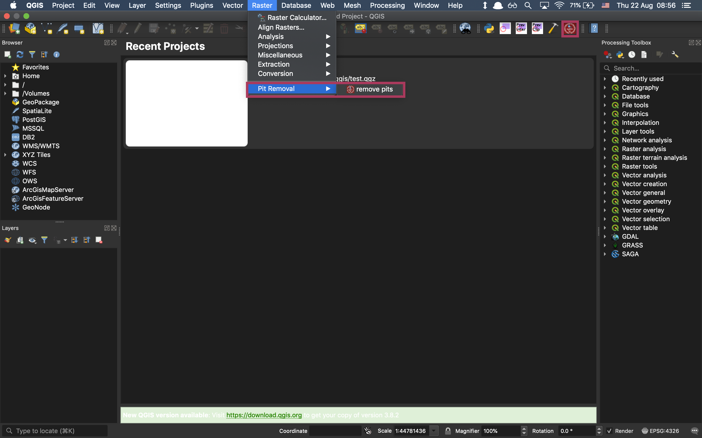

# Pit Removal Module in QGIS

## Table of Contents

- [Install](#install)
- [Usage](#usage)
- [Maintainers](#maintainers)
- [Contributing](#contributing)
- [License](#license)
- [TODO](#TODO)

## Install
> Build from scratch

First, make sure you have [git](https://git-scm.com/) installed on your local computer.

Then open your terminal in the folder where you want to git, and clone this repository with 
```
git clone https://github.com/chrimerss/PitRemoval
```

At last, make sure the folder exists in:

for Mac user: 

go to the folder where you have python plugin inside, for example /Applications/QGISx.x.app/Resources/python/plugins/

for Windows user:

corresponding repo (haven't tested yet)

> Search inside QGIS plugin

coming soon...

## Usage

If you intend to use it in terminal instead of QGIS, you may need some prerequisites to successfully run this, e.g. GDAL, numpy.

While most of the case, you will play with QGIS environment since it has all prerequisites installed. Just open QGIS, it will automatically load the plugin, and you can find it in your toolbar/plugins/raster menu.

If it does not show up, you may need to activate by:

click plugin menu

click manage plugins

then tick 'pit removal' plugin.




## Maintainers

[@chrimerss](https://github.com/chrimerss)

## Contributing


## License

MIT © 2018 


## TODO
- [ ] fix issues with Chandevar islands catchment
- [ ] fix issues that duplicate raster layer name
